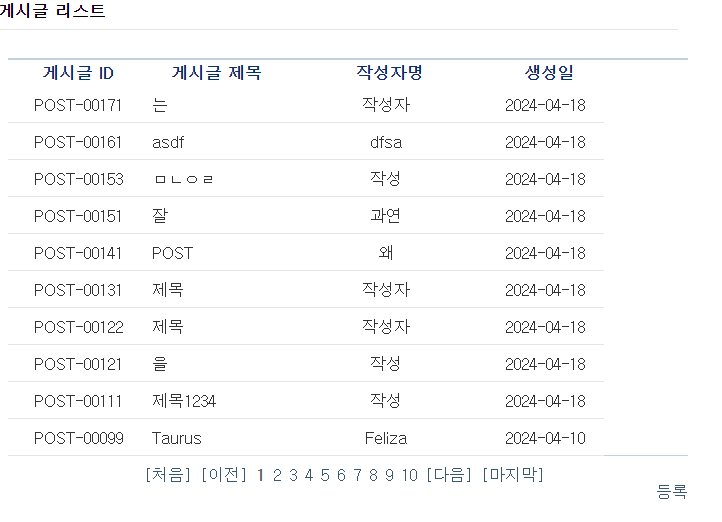

# Simple-Board

전자정부프레임워크 게시판 예시를 참고하여 만든 레포지토리입니다.




- [전자정부프레임워크 심플 게시판 Repo](https://github.com/eGovFramework/egovframe-web-sample)

## 개발 환경

- 전자정부프레임워크 4.2 (Eclipse)
- Java 1.8
- Spring MVC (Spring 5)
- WAS : Tomcat 9.0
- DB : MariaDB (docker-compose 이용)
- ORM : MyBatis
- View Template : JSP

## 실행 방법

### 사전 준비

1. JAVA 1.8을 설치합니다.
2. [전자정부프레임워크 개발환경 설치가이드](https://www.egovframe.go.kr/wiki/doku.php?id=egovframework:dev4.2:clntinstall)를 참고하여 JAVA 개발 환경 및 WAS를 준비합니다.
3. docker를 자신의 OS 환경에 맞게 설치합니다. mac과 윈도우의 경우 docker desktop도 설치하는 것을 권장합니다.

### 서버 실행 방법
1. MariaDB 서버를 가동합니다. 로컬에 설치된 MariaDB 서버가 없을 경우 레포지토리 디렉토리 내에서 다음 명령어를 입력하여 도커로 MariaDB 서버를 엽니다.
    ```bash
    docker-compose up -d
    ```
2. Tomcat 9.0을 이클립스의 서버에 추가하여 가동한다.
3. Tomcat 서버 베이스로 프로젝트 WAR를 실행한다.
